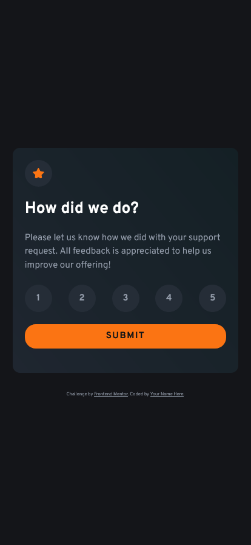

# Frontend Mentor - Interactive rating component solution

This is a solution to the [Interactive rating component challenge on Frontend Mentor](https://www.frontendmentor.io/challenges/interactive-rating-component-koxpeBUmI). Frontend Mentor challenges help you improve your coding skills by building realistic projects.

## Table of contents

- [Overview](#overview)
  - [The challenge](#the-challenge)
  - [Screenshot](#screenshot)
- [My process](#my-process)
  - [Built with](#built-with)
  - [What I learned](#what-i-learned)

## Overview

### The challenge

Users should be able to:

- View the optimal layout for the app depending on their device's screen size
- See hover states for all interactive elements on the page
- Select and submit a number rating
- See the "Thank you" card state after submitting a rating

### Screenshot




## My process

### Built with

- Semantic HTML5 markup
- CSS custom properties
- Flexbox
- Mobile-first workflow
- JavaScript

### What I learned

I am most proud of the rating-numbers. I used radio buttons and styled with CSS.

```
<input type="radio" name="rate" id="rate1" value="1" />
            <label for="rate1">1</label>
```

```
#ratings input {
  opacity: 0;
  position: fixed;
  width: 0;
}
#ratings input:checked + label {
  background: var(--color-white);
  color: var(--color-grey950);
}
#ratings label {
  display: block;
  position: relative;
  width: 3rem;
  height: 0;
  padding-bottom: 3rem;
  background: var(--color-grey900);
  line-height: 3;
  border-radius: 50%;
  cursor: pointer;
  text-align: center;
  font-weight: 700;
}
#ratings label:hover {
  background: var(--color-orange);
  color: var(--color-grey950);
}
```
